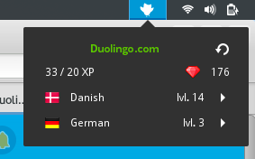

# gnome-shell-extensions-duolingo-status

###DESCRIPTION

Display useful information about your Duolingo account, and offers a direct link to the website.

###SCREENSHOT

###REQUIREMENTS

In the Preferences menu, enter your Duolingo username.

###CREDITS

Thanks to Duolingo for the logo, that has been slightly altered for my use.  
Thanks to Custom Icon Design for the flag icons: [link](http://www.customicondesign.com/).  
Thanks to FatCow WebHosting for the ruby icon, that has been slightly altered: [link](http://www.fatcow.com/free-icons/) [Creative Commons](http://creativecommons.org/licenses/by/3.0/us/).  
Thanks to IconFinder for finding my icons.  

###CHANGELOG

2015/10/24: update gnome-shell 3.18, update getImprovement method.  
2015/09/16: option allowing hiding the icon in the top bar, once the daily goal is reached.  
2015/11/22: option allowing changing the icon color when the daily goal is reached.  
2015/11/26: add new Klingon, Catalan, Czech, Swahili and Welsh flags.  
